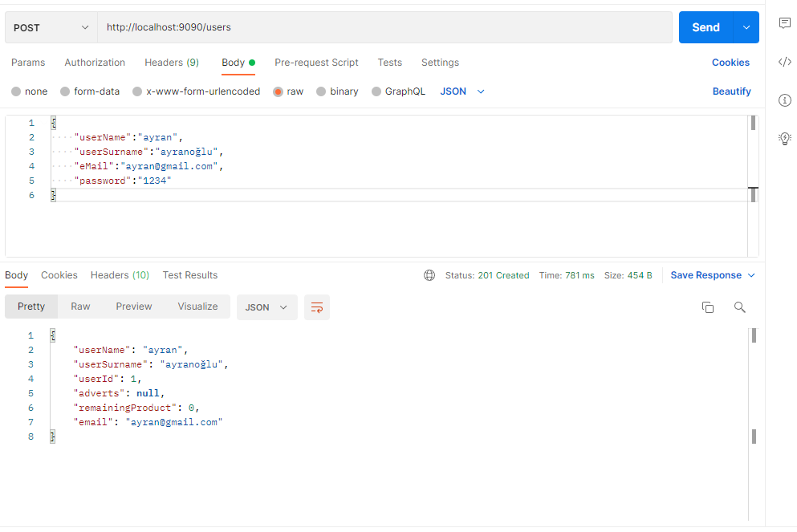
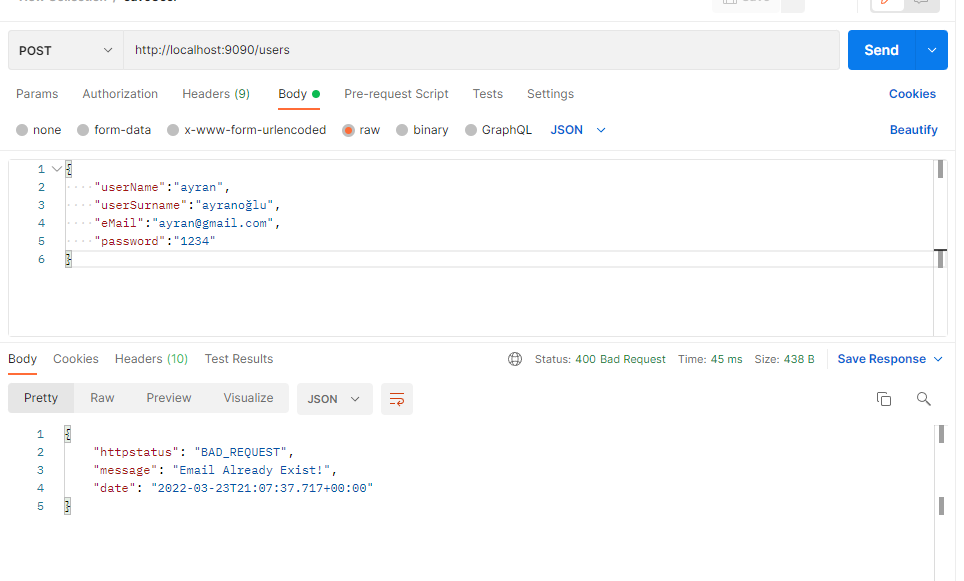
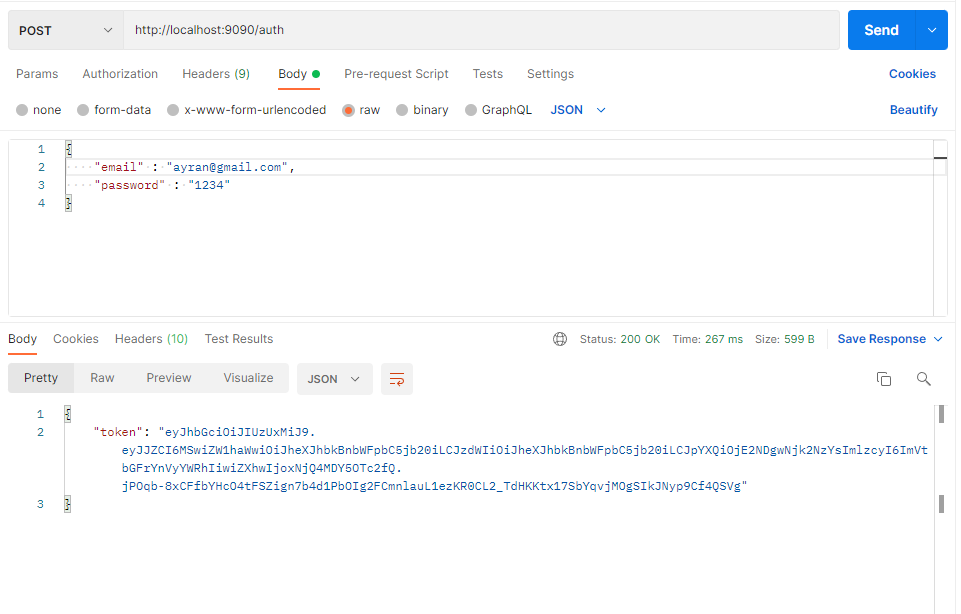
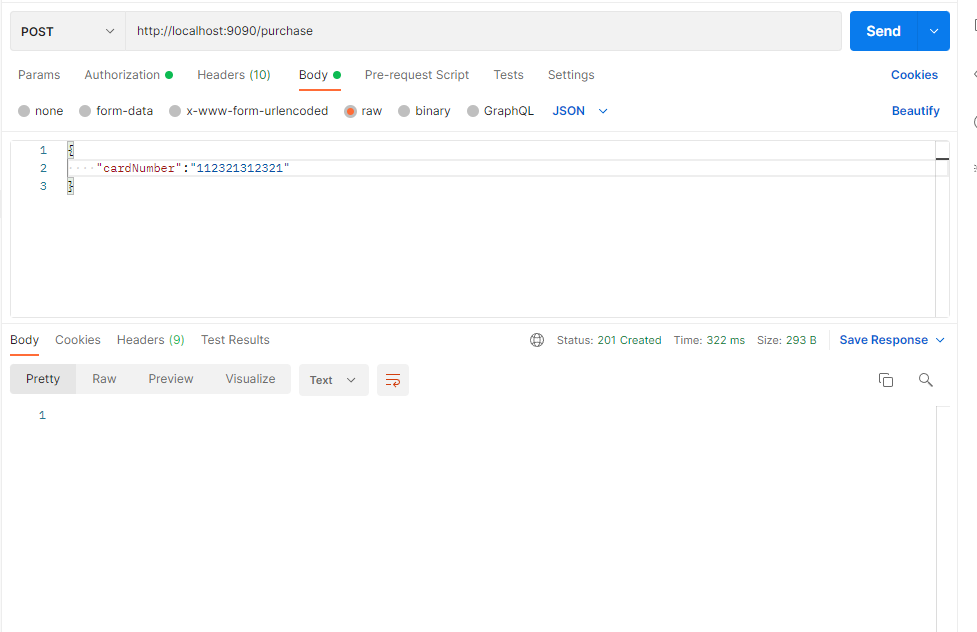
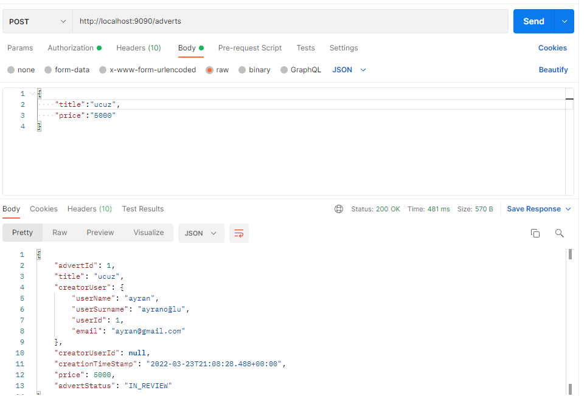
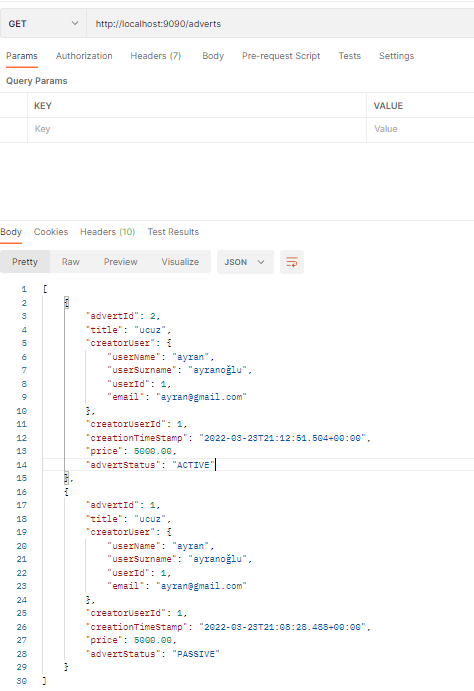
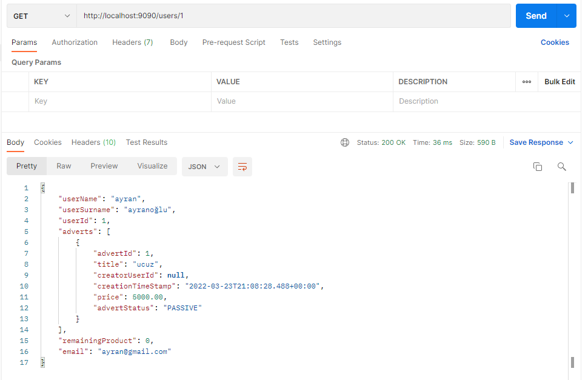
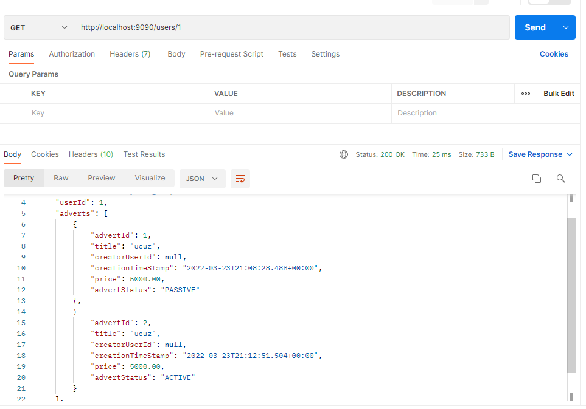

# Emlak Burada

## Yükleme 

Programın düzgün çalışabilmesi için 3306, 3308, 3309 portlarında çalışan 3 adet MySql Database'i çalışıyor olmalı. 

    
## Servisler
- Advert Service
- User Service
- Auth Service
- Purchase Service
- Review Service
- Gateway Service
- Discovery Service

  # Advert Service

Advert Service ile ilan kayıtları yapılır, güncellenir ve görüntülenir. 

İlan kaydı yapabilmek için sisteme giriş yaptıktan sonra (authentication) başlık ve fiyat bilgisi girilerek ilan oluşturulur. Kullanıcının id'si header'dan alınan token ile bulunur. (açıklama, ilan verilen emlak ile ilgili diğer bilgiler de eklenerek bu kısım geliştirilebilir)

İlan oluşturulduktan sonra user service ve review service'e asenron olarak RabbitMq kullanılarak gerekli bilgiler gönderilir. İlan oluşturulduğunda inceleme (In_Review) haldedir review service'ten yanıt geldiğinde aktif ya da pasif duruma geçer.

Bir kullanıcıya ait tüm ilanları /adverts/{userId} adresine get isteği atarak elde edebilirsiniz.

Kullanıcı kendi aktif ilanlarını /adverts/active, pasif ilanlarını /adverts/passive adreslerine, sisteme giriş yaptıktan sonra, get isteği atarak elde edebilirsiniz.

/adverts 'e get isteği atarak sistemdeki tüm ilanları görüntüleyebilirsiniz. (Bu method sadece aktif ilanları gösterecek hale getirilebilir)

Sisteme giriş yaptıktan sonra /adverts adresine put isteği atarak ilanda güncellemek istediğiniz kısımları güncelleyebilirsiniz. (İlanın durumu dahil, ilan incelemede ise güncelleme yapılamaz) 

Put isteği atıldığında hatalı advertId gönderildiyse AdvertNotFoundException fırlatılır

Put isteği atıldığında ilan inceleme aşamasındaysa AdvertInReviewException fırlatılır

Put isteği atıldığında kullanıcı kendine ait olmayan bir ilanda güncelleme yapmayı denemişse AdvertDoesNotBelongToThisUserException fırlatılır.

# User Service

User Service ile kullanıcı kayıtları yapılır, güncellenir ve görüntülenir. 

Sisteme kayıt olabilmek için eposta adresi, şifre, kullanıcı adı ve soyadı gereklidir. Her kullanıcının eposta adresi birbirinden farklı olmak zorundadır. Var olan bir eposta adresi ile kayıt olunmaya çalışıldığında EmailAlreadyExistException hatası fırlatılır.

/users adresine Put isteği gönderilerek kullanıcının bilgileri güncellenebilir.

/users/products adresine Get isteği gönderilerek kullancının sahip olduğu ilan hakkı bilgisi elde edilir.

# Auth Service

Sisteme giriş yapmak için bu service istek atılır ve atılan istek doğruysa içerisinde kullancının epostasının ve id'sinin olduğu bir token geri döner.

Girilen parola hatalı ise UserPasswordNotValidException fırlatır.

# Purchase Service

Kulalncının ilan verebilme hakkı satın alması için bu service Post isteği göndermesi gerekmektedir. Verilen token ile kullanıcı bilgileri alınır, requestbody de ise kredi kartı bilgileri talep edilmekte. (Kart ile ilgili herhangi bir işlem yapılmıyor yalnızca bilgiler alınıp user'a ilan hakkı tanımlanıyor)

Feign kullanılarak User Service bilgilendiriliyor eğer bu request esnasında hata ile karşılaşılırsa Hystrix yardımı ile Rabbit Mq üzerinden bilgiler gönderiliyor.

# Review Service

Bir ilan kayıt edildiğinde ilanın durumu öncelikle In_Review olur review service'te inceleme yapıldıktan sonra aktif ya da pasif olarak durumunu Advert Service'e bildirir. 

Review aşamasında User Service'ten ilan veren kullanıcının ilan verme hakkına sahip olup olmadığı sorgulanır. Kullanıcı ilan verme hakkına sahipse ilan durumu aktif olarak Advert Service'e bildirilir. 

# Gateway Service

Bu servis gelen istekleri ilgili servislere dağıtma görevini yerine getirmektedir. Eğer sisteme giriş yapıldıktan sonra işlem yapılması gereken bir durum varsa bu durumu yine bu servis kontrol eder.

# Ekran Görüntüleri

Kullanıcı kaydı

Var olan e-posta ile kullanıcı kaydı

Sisteme giriş yapma

Sisteme giriş yapma

İlan hakkı satın alma

İlan oluşturma

Tüm ilanları görüntüleme

Belirli bir kullanıcıyı görüntüleme

